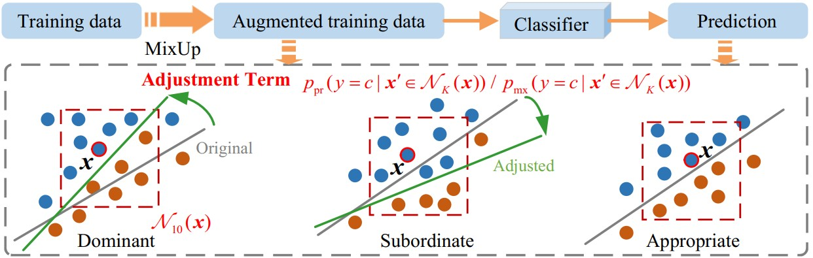

# Introduction
We propose a novel logit-adjusted loss, termed CALA, which incorporates both the class priors and the ratio of the class-conditional probability densities for the training and test data. We then leverage the information of the $K$-nearest neighbors to estimate the class-conditional probability density ratio in the CALA loss, leading to a novel GLT approach called Heuristic-CALA.

<p align="center">
    
</p>


# Heuristic-CALA
A code framework that uses pytorch to implement Heuristic-CALA.

## Environment
- python 3.8
- pytorch 1.9.0
- torchvision 0.10.0

## Running this example
ResNet32 on CIFAR10-LT with an imbalance factor of 10:
```
python train.py --dataset cifar10 --class_num 10 --imb_factor 10 --nk 40 --tau1 1.5 --tau2 1
```
