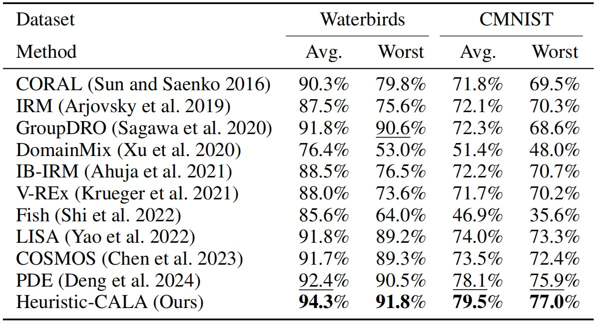
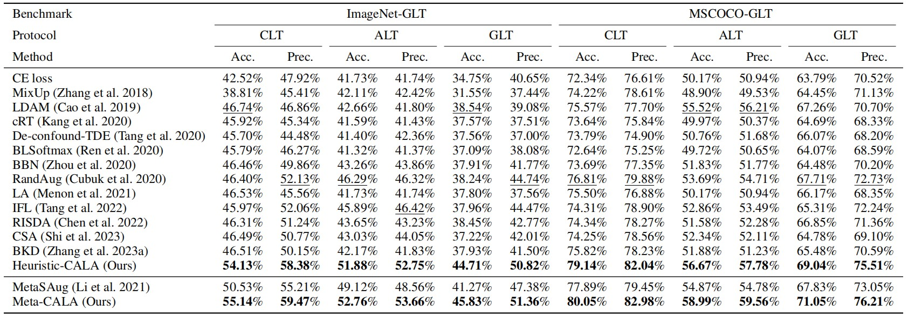

# CALA-Pytorch

The Class-Attribute Aware Logit Adjustment (CALA) algorithm implemented in Pytorch.

## Introduction

This study aims to directly estimate this ratio, for which a novel generalized logit adjustment (CALA) loss incorporating both the ratio of the class-conditional probability densities and the class priors is presented. A new GLT method, named Heuristic-CALA, is then proposed, which employs a $K$-neighborhood-based estimation approach. Several classical long-tail learning methods can be considered as special cases of Heuristic-CALA. Furthermore, given the strong performance of meta-learning, we propose a meta-learning-based estimation approach, resulting in another GLT method named Meta-CALA. 

    

## Get Started

Please obtain the specific implementations of Heuristic-CALA and Meta-CALA from folders "./Heuristic-CALA" and "./Meta-CALA".

## Results

- Image classification on CIFAR-LT

    

- Image classification on subpopulation shift datasets

    

- Image classification on ImageNet-GLT and MSCOCO-GLT

    

